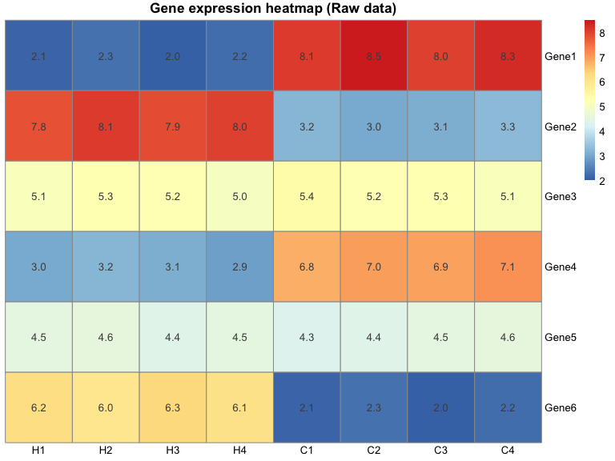
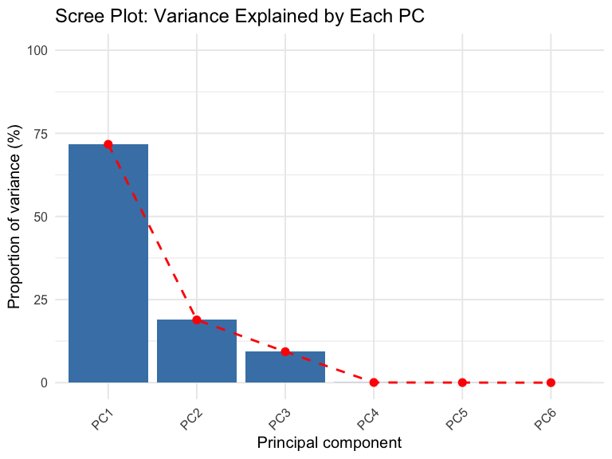
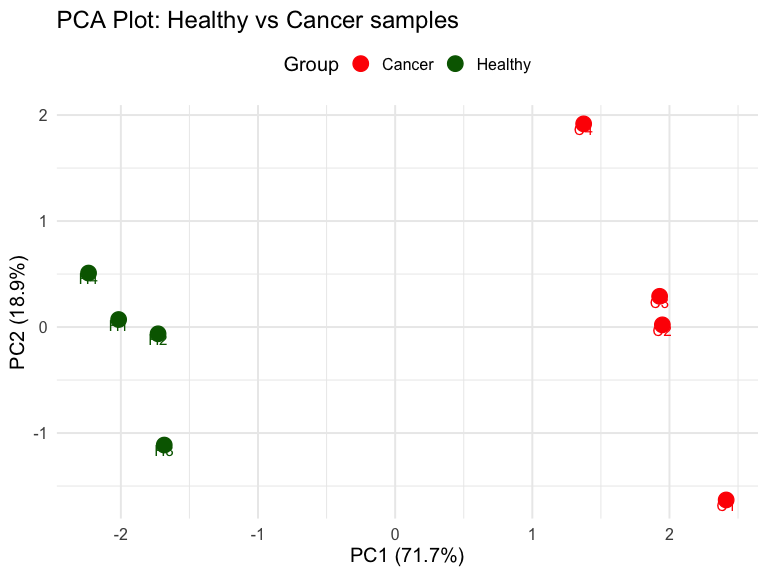
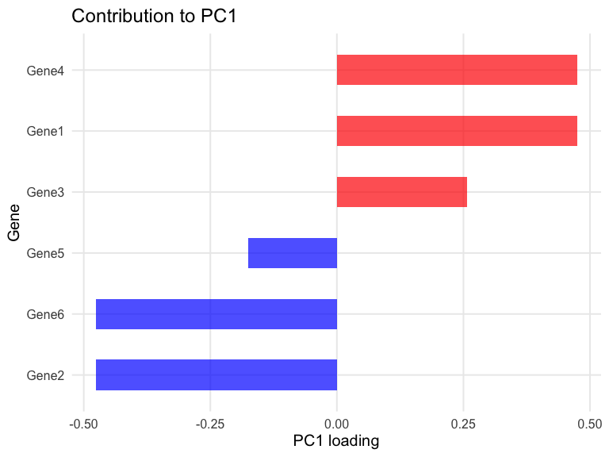

``` r
knitr::opts_chunk$set(echo = TRUE, fig.width = 8, fig.height = 6, warning = FALSE, message = FALSE)
library(ggplot2)
library(pheatmap)
library(reshape2)
set.seed(123)
```

# Principal Component Analysis

## Why PCA?

Imagine studying gene expression in healthy control and cancer patient
tissues. Activity of ~20,000 genes in each tissue is measured. How do
you

- `Visualize` these data?

  - 2 genes = 2 dimensions = xy-scatter plot to understand patterns
  - 20,000 genes = 20,000 dimensions = plotting in a way our brain gets
    it easily is not possible

- `Find patterns` that distinguish healthy from diseased tissue?

- `Identify` which tissues are similar to each other?

PCA is like creating a summary of data. It finds the most important
patterns and lets you visualize complex data in 2D or 3D.

## What does PCA do?

- `Before PCA`: Data include many variables (genes) that might be
  correlated with each other  
- `After PCA`: Another data including a few *principal components (PCs)*
  that capture most of the variation  

Each PC is a combination of original genes (like a weighted average)  

*Instead of looking at 20,000 genes separately, PCA lets you look at 2-3
PCs that capture most of the important differences between samples.*

------------------------------------------------------------------------

## Example dataset: gene expression in cancer

Using a much smaller dataset than real data to understand PCA: **8
samples** (4 healthy, 4 cancer) and **6 genes**.

``` r
# Create a small gene expression dataset
# Rows = genes, Columns = samples (this is standard in genomics)

gene_expression <- matrix(c(
  # Healthy samples (H1-H4)    Cancer samples (C1-C4)
  2.1, 2.3, 2.0, 2.2,          8.1, 8.5, 8.0, 8.3,  # Gene1 - highly expressed in cancer
  7.8, 8.1, 7.9, 8.0,          3.2, 3.0, 3.1, 3.3,  # Gene2 - highly expressed in healthy
  5.1, 5.3, 5.2, 5.0,          5.4, 5.2, 5.3, 5.1,  # Gene3 - similar in both
  3.0, 3.2, 3.1, 2.9,          6.8, 7.0, 6.9, 7.1,  # Gene4 - higher in cancer
  4.5, 4.6, 4.4, 4.5,          4.3, 4.4, 4.5, 4.6,  # Gene5 - very similar
  6.2, 6.0, 6.3, 6.1,          2.1, 2.3, 2.0, 2.2   # Gene6 - higher in healthy
), nrow = 6, byrow = TRUE)

rownames(gene_expression) <- paste0("Gene", 1:6)
colnames(gene_expression) <- c("H1", "H2", "H3", "H4", "C1", "C2", "C3", "C4")
```

### Visualize raw data



`Gene1` and `Gene4` are high in cancer samples (C1-C4); `Gene2` and
`Gene6` are high in healthy samples (H1-H4); `Gene3` and `Gene5` are not
different between the two tissues.

## Why `Center` and `Scale`

### Centering

**Centering** means subtracting the gene’s average from each gene’s
values. This shifts the center of the data cloud to the origin at zero;
all genes have a mean of zero, so the focus is on the differences from
0, not the absolute expression values.

### Scaling

**Scaling** means dividing each gene’s value by the standard deviation
(SD) of the gene. All genes have the same spread (SD = 1), so genes with
small changes aren’t ignored.

Different genes have different scales. Gene1 ranges from 2 to 8.5 (range
= 6.5), while Gene4 ranges from 2.9 to 7.1 (range = 4.2). Both genes
distinguish healthy from cancer, but Gene1 has larger range and numbers.
Without scaling, Gene1 would dominate the PCA even though both genes are
significantly important biologically.

In real datasets, there could be housekeeping genes with large ranges
just because they’re highly expressed, not because they’re biologically
important. Scaling ensures we focus on relative changes, not absolute
expression levels.

If scaling is not done, genes with larger numbers will dominate the PCA,
even if they’re not biologically more important.

In genomics, data are usually centered and scaled because different
genes have different expression ranges. The pattern of genes changing
together is important, not their absolute values.

------------------------------------------------------------------------

## Running PCA

Performing PCA using `prcomp()` in R requires **samples as rows** and
**genes as columns**.

``` r
# Transpose the data so samples are rows
pca_data <- t(gene_expression)
# Run PCA with centering and scaling
pca_result <- prcomp(pca_data, center = TRUE, scale. = TRUE)
```

Data transposed for PCA (samples as rows):

    ##    Gene1 Gene2 Gene3 Gene4 Gene5 Gene6
    ## H1   2.1   7.8   5.1   3.0   4.5   6.2
    ## H2   2.3   8.1   5.3   3.2   4.6   6.0
    ## H3   2.0   7.9   5.2   3.1   4.4   6.3
    ## H4   2.2   8.0   5.0   2.9   4.5   6.1
    ## C1   8.1   3.2   5.4   6.8   4.3   2.1
    ## C2   8.5   3.0   5.2   7.0   4.4   2.3
    ## C3   8.0   3.1   5.3   6.9   4.5   2.0
    ## C4   8.3   3.3   5.1   7.1   4.6   2.2

The PCA result has the following components: sdev, rotation, center,
scale, x

### Standard deviations and variance explained

Standard deviations of each PC: 2.074067, 1.0641969, 0.7478656,
0.0622754, 0.042597, 0.0271171.

``` r
# Variance explained by each PC
variance_explained <- pca_result$sdev^2
proportion_variance <- variance_explained / sum(variance_explained)
cumulative_variance <- cumsum(proportion_variance)

variance_df <- data.frame(
  PC = paste0("PC", 1:length(pca_result$sdev)),
  PC_variance = round(variance_explained,4),
  Variance_explained = round(proportion_variance * 100, 2),
  Cumulative_explained = round(cumulative_variance * 100,2)
)
```

Variance explained:

    ##    PC PC_variance Variance_explained Cumulative_explained
    ## 1 PC1      4.3018              71.70                71.70
    ## 2 PC2      1.1325              18.88                90.57
    ## 3 PC3      0.5593               9.32                99.89
    ## 4 PC4      0.0039               0.06                99.96
    ## 5 PC5      0.0018               0.03                99.99
    ## 6 PC6      0.0007               0.01               100.00

`Total variance` = all the differences between samples across all
genes.  
- `PC1` captures the largest chunk of these differences  
- `PC2` captures the next largest chunk (independent of PC1)

PC1 explains 71.7% of all variance! That means most of the differences
between samples can be seen in just one dimension.

``` r
# Scree plot
ggplot(variance_df, aes(x = PC, y = Variance_explained)) +
  geom_bar(stat = "identity", fill = "steelblue") +
  geom_line(aes(group = 1), color = "red", linewidth = 1, lty = "dashed") +
  geom_point(color = "red", size = 3) +
  lims(y = c(0,100)) +
  labs(title = "Scree Plot: Variance Explained by Each PC",
       y = "Proportion of variance (%)",
       x = "Principal component") +
  theme_minimal(15) +
  theme(axis.text.x = element_text(angle = 45, hjust = 1))
```



### PC scores (sample coordinates)

`PC scores` inform where each sample is located in the PC space.

``` r
# Get PC scores
pc_scores <- pca_result$x

# Create a data frame for plotting
pc_df <- as.data.frame(pc_scores)
pc_df$Sample <- rownames(pc_scores)
pc_df$Group <- ifelse(grepl("^H", pc_df$Sample), "Healthy", "Cancer")
```

PC Scores (coordinates of samples in PC space):

    ##      PC1   PC2   PC3   PC4   PC5   PC6
    ## H1 -2.02  0.07 -0.27  0.01  0.05 -0.03
    ## H2 -1.73 -0.06  1.52 -0.03 -0.04 -0.01
    ## H3 -1.68 -1.11 -0.28 -0.06  0.04  0.04
    ## H4 -2.24  0.51 -0.85  0.08 -0.05  0.00
    ## C1  2.41 -1.63 -0.05  0.04 -0.04  0.01
    ## C2  1.95  0.02 -0.64 -0.08 -0.01 -0.04
    ## C3  1.93  0.29  0.57  0.08  0.06  0.00
    ## C4  1.37  1.92  0.00 -0.04 -0.01  0.03

The PCA plot is generated using the PC sample scores. Each sample gets a
score that’s a weighted average of the gene expression. The 2D plot of
PC1 (x-axis) and PC2 (y-axis) is the standard output of PCA.

``` r
ggplot(pc_df, aes(x = PC1, y = PC2, color = Group, label = Sample)) +
  geom_point(size = 5) +
  geom_text(vjust = 1, size = 4) +
  labs(title = "PCA Plot: Healthy vs Cancer samples",
       x = paste0("PC1 (", round(proportion_variance[1]*100, 1), "%)"),
       y = paste0("PC2 (", round(proportion_variance[2]*100, 1), "%)")) +
  theme_minimal(15) + theme(legend.position = "top") +
  scale_color_manual(values = c("Healthy" = "darkgreen", "Cancer" = "red"))
```



Does either PC1 (left to right) or PC2 (top to bottom) capture any
differences between the samples? - For this data, PC1 separates healthy
from cancer perfectly. - PC2 captures smaller differences within groups.
For example, C2 and C3 are closer together in gene expression based on
all genes when compared to other cancer samples.

### Rotation matrix (gene loadings)

The `rotation matrix` (also called `loadings`) show how much each gene
contributes to each PC and which genes drive the separation in the PCA
plot.

The mathematical core or heart of PCA is how these loadings are
computed!

- Corr/Covariance matrix: PCA first calculates how genes vary together
  across samples. This is captured in the correlation matrix (when
  `scale=TRUE`) or covariance matrix (when `scale=FALSE`). The matrix
  *C* = \[1/*n*\]\[*X*<sup>*T*</sup>*X*\] says how much any two genes
  tend to increase/decrease together. Here, X = matrix of `n` samples
  and `p` genes. A 6-gene dataset produces a 6×6 correlation matrix
  (because `scale = TRUE`).

- Eigenvalue decomposition: Using the matrix `C`, this step finds the

  - eigenvectors (the loadings) = directions in gene space that capture
    the most variance; and
  - eigenvalues = how much variance each direction captures
  - i.e., basically V and D are computed in the equation
    *C* = *V**D**V*<sup>*T*</sup> where
    - V = matrix of eigen vectors which are the loadings or rotation
      matrix  
    - D = diagonal matrix of eigenvalues which represent the variance
      explained

``` r
# Get loadings
loadings <- pca_result$rotation
```

Loadings (how genes contribute to PCs):

    ##          PC1    PC2    PC3
    ## Gene1  0.474  0.159 -0.064
    ## Gene2 -0.476 -0.128  0.090
    ## Gene3  0.257 -0.582  0.770
    ## Gene4  0.474  0.163 -0.023
    ## Gene5 -0.175  0.757  0.628
    ## Gene6 -0.476 -0.143  0.009

For a specific PC, large positive values mean that the gene increases
and large negative values mean that the gene decreases. Near zero = Gene
doesn’t contribute much to that PC. Gene

``` r
# Plot loadings for PC1
loading_df <- data.frame(Gene = rownames(loadings), PC1 = loadings[, 1], PC2 = loadings[, 2])
loading_df <- loading_df[order(loading_df$PC1), ]
loading_df$Gene <- factor(loading_df$Gene, levels = loading_df$Gene)

ggplot(loading_df, aes(x = Gene, y = PC1, fill = PC1 > 0)) +
  geom_bar(stat = "identity", width = 0.5, alpha = 0.7) +
  labs(title = "Contribution to PC1", y = "PC1 loading", x = "Gene") +
  theme_minimal(15) + theme(legend.position = "none", panel.grid.minor.x = element_blank()) +
  scale_fill_manual(values = c("TRUE" = "red", "FALSE" = "blue")) +
  coord_flip()
```



- Positive loadings on PC1: Genes high in cancer (Gene1, Gene4)
- Negative loadings on PC1: Genes high in healthy (Gene2, Gene6)
- PC1 captures “cancer vs healthy” signature

------------------------------------------------------------------------

## Verify PC scores are weighted sums of gene expression

**Formula**: PC1 score for a sample = (Gene1 × loading1) + (Gene2 ×
loading2) + … + (Gene6 × loading6)

Gene1, Gene2,.. refer to the gene expression data that were centered and
scaled. The scaled gene expression for sample H1 is the first row of the
matrix below:

``` r
# calculate PC1 for sample H1
verify_df <- scale(pca_data)
print(verify_df)
```

    ##         Gene1      Gene2      Gene3      Gene4      Gene5      Gene6
    ## H1 -0.9495426  0.8760009 -0.7637626 -0.9578263  0.2415229  0.9573051
    ## H2 -0.8880338  0.9928011  0.7637626 -0.8620437  1.2076147  0.8639095
    ## H3 -0.9802970  0.9149343  0.0000000 -0.9099350 -0.7245688  1.0040029
    ## H4 -0.9187882  0.9538677 -1.5275252 -1.0057176  0.2415229  0.9106073
    ## C1  0.8957224 -0.9149343  1.5275252  0.8620437 -1.6906606 -0.9573051
    ## C2  1.0187400 -0.9928011  0.0000000  0.9578263 -0.7245688 -0.8639095
    ## C3  0.8649680 -0.9538677  0.7637626  0.9099350  0.2415229 -1.0040029
    ## C4  0.9572312 -0.8760009 -0.7637626  1.0057176  1.2076147 -0.9106073
    ## attr(,"scaled:center")
    ##  Gene1  Gene2  Gene3  Gene4  Gene5  Gene6 
    ## 5.1875 5.5500 5.2000 5.0000 4.4750 4.1500 
    ## attr(,"scaled:scale")
    ##     Gene1     Gene2     Gene3     Gene4     Gene5     Gene6 
    ## 3.2515656 2.5684904 0.1309307 2.0880613 0.1035098 2.1414281

The loadings for PC1 are the first column of the matrix below.

``` r
print(loadings)
```

    ##              PC1        PC2         PC3         PC4         PC5         PC6
    ## Gene1  0.4743525  0.1587277 -0.06396181 -0.30015398 -0.61523038 -0.52640604
    ## Gene2 -0.4762399 -0.1283824  0.08979956 -0.08013844 -0.74327756  0.43562127
    ## Gene3  0.2571723 -0.5821660  0.77005739 -0.02366619  0.01031011 -0.03592177
    ## Gene4  0.4743871  0.1631164 -0.02257252 -0.54653730  0.11138660  0.66085581
    ## Gene5 -0.1747129  0.7565285  0.62789871  0.00202192  0.03142413 -0.04349296
    ## Gene6 -0.4758992 -0.1430518  0.00949931 -0.77731475  0.23564657 -0.30531685

``` r
# sample H1
h1_scaled <- verify_df[1, ]  # H1 scaled gene values
pc1_loadings <- loadings[, 1]
h1_pc1 <- sum(h1_scaled * pc1_loadings)
```

PC1 score for H1 (manual): -2.0162  
`prcomp()` result: -2.0162

------------------------------------------------------------------------

## PCA summary

- PCA reduces dimensionality: From 6 genes to 2 PCs that capture most
  variation
  - Example: PC1 is the best summary of example data because captures
    the direction of maximum variance
- Variance explained matters: If PC1 and PC2 explain 90%+ of variance,
  you can safely visualize your data in 2D  
- Loadings show gene importance: Large loadings indicate which genes
  drive the patterns
- PCA is unsupervised: Without using healthy and cancer labels PCA
  computations find the separation.

## Clinical Relevance

PCA can help - identify subtypes of a disease  
- find outliers that is, samples that don’t fit expected patterns. These
could be due to tissue contamination or rare variants  
- identify bath effects and further adjust for them; and visualize
before/after adjustment  
- with biomarker discovery such as genes with high loadings on
clinically relevant PCs
